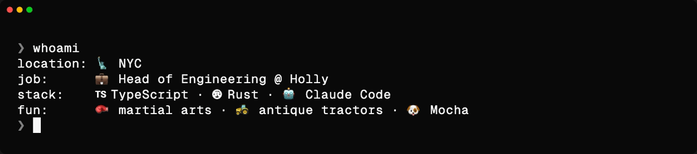

<!--
  ─────────────────────────────────────────────────────────────
   zrosenbauer/zrosenbauer · GitHub profile README
   Banner: assets/whoami.gif (Geist Mono · Vercel-y dark theme)
           generated from assets/whoami.tape via charmbracelet/vhs.
           Edit bio lines in: assets/whoami
           Build:  pnpm profile:gif
   Tech badges use natural brand colors (TS blue, Rust orange…).
  ─────────────────────────────────────────────────────────────
-->

---

📁 <code>~/work</code>

> **Head of Engineering @ [Holly](https://hollygov.com)** — building modern software for local government.

📁 <code>~/oss</code>

🚜 **[The Byte Farm](https://github.com/thebytefarm)** — a little farm growing open source, one byte at a time:

- [**hopper**](https://github.com/thebytefarm/hopper) — an IDE built for agents. Plan, run, and review code with your fleet by your side. _(coming soon)_
- [**ciderpress**](https://github.com/thebytefarm/ciderpress) — opinionated, zero-config docs framework for monorepos. Point it at your markdown.
- [**maltty**](https://github.com/thebytefarm/maltty) — full-featured CLI framework for Node.js. Prebuilt components and a Storybook for the terminal.
- [**marxml**](https://github.com/thebytefarm/marxml) — fast markdown + XML query and mutation. Rust core, JS bindings.

Elsewhere:

- [**voltagent**](https://github.com/voltagent/voltagent) — open-source TypeScript framework for building, observing, and shipping AI agents. _(contributor)_
- [**viteval**](https://github.com/viteval/viteval) — next-generation LLM evaluation framework powered by Vitest.
- [**lauf**](https://github.com/zrosenbauer/lauf) — discover, validate, and execute TypeScript scripts with Zod-powered arguments.
- [**namescout**](https://github.com/zrosenbauer/namescout) — npm package naming toolkit: generate names, check availability, detect squatters, vibe-check the registry.

📁 <code>~/stack</code>

<table>
<tr>
<th>Languages</th>
<th>Web</th>
<th>Native</th>
</tr>
<tr>
<td valign="top">

 

</td>
<td valign="top">

 

 

</td>
<td valign="top">

</td>
</tr>
<tr>
<th>AI</th>
<th>Infra</th>
<th>Tools</th>
</tr>
<tr>
<td valign="top">

</td>
<td valign="top">

 

</td>
<td valign="top">

 

</td>
</tr>
</table>

📁 <code>~/about</code>

- 💍 Married my soulmate **Sarah**
- 🐶 Dad to a wonderful puppers named **Mocha**
- 🥊 On the mat for martial arts a couple times a week — multiple styles, mostly self-defense systems
- 🚜 Restoring antique tractors when life lets me (& farming if they let me…)
- 🌽 Raised in rural Ohio, in the middle of a cornfield
- 🧦 Got my "tech sealegs" in the Windy City (Chicago)
- 🐻 Heart in Berlin — 2–3x a year you can find me parked at [St. Oberholz](https://sanktoberholz.coffee/) with a Kaffee
- 🏈 Former college fullback ([proof](https://www.youtube.com/watch?v=KYwfzejSyxQ&amp;t=260s)) — yes, headbutting linebackers prepped me for headbutting segfaults
- 😄 Pronouns: He/Him/His

<a href="https://zrosenbauer.com"><b>zrosenbauer.com</b></a> &nbsp;·&nbsp; <a href="https://hollygov.com"><b>hollygov.com</b></a>

